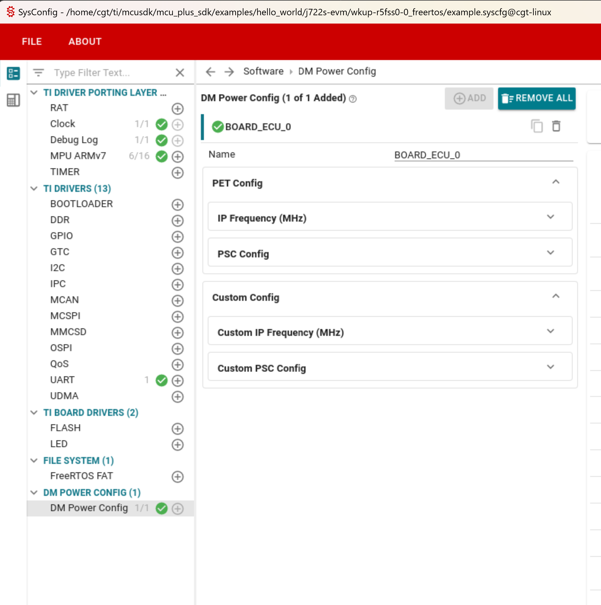

# User Guide for Power Configuration Files
## Overview
These handcrafted files are used to configure power tools and are applicable for the DM power configuration and JTAG power analysis tools.

The JTAG power analysis tool utilizes the configuration files to display the PET (Power Estimation Tool) summary.

The DM power configuration tool uses these files to provide a graphical user interface (GUI) along with the relevant data for each field in the GUI.

Users can customize the power configuration files to add or remove IPs/PSCs. The files can be found in the `config/.meta/<soc>/` directory.

## Adding custom IPs and PSC in the tool



In `config/.meta/<soc>/`, user can add custom IPs and PSCs using the `custom_ip_mapping.json` and `custom_psc_list.json` files. These files should follow the same JSON schema as the `pet_ip_mapping.json` and `pet_psc_list.json` files described below.


#### `pet_ip_mapping.json`:

This JSON file is used to print PET IPs in the JTAG power analysis tool and the IP Frequency configuration in the DM Power Config tool.

Each entry in the JSON file represents an IP and contains the following fields:

* `displayName`: This is the name displayed in the GUI.

* `ip_name`: This is the IP name defined in the TISCI documentation.

* `input_name`: This is the name of the clock signal that drives the IP or any clock in the clock path.

* `lpsc_name`: The name of the LPSC to which the IP is connected. You can find this information in the TRM for your specific SoC.

* `tisci_ip_name`: This is the name of the TISCI device.

* `tisci_input_name`: This is the name of the clock input to the TISCI device.

* `programmable`: This is a boolean flag that indicates if the IP's frequency can be programmed or not.
 If not programmable, it will still show in GUI with non-editable `default_freq_mhz`

* `dependent_psc_list`: Some IPs require other LPSC/Devices to be enabled first. This list includes the TISCI device names of those IPs.

* `default_freq_mhz`: This is the default frequency (in MHz) that will be used in the GUI.

* `enableLpsc` : Boolean to IP`s LPSC and its dependency to enable when IP freq is configured.

Example entry
```
    "VPAC 0": {
        "ip_name": "J784S4_DEV_VPAC0",
        "input_name": "DEV_VPAC0_MAIN_CLK",
        "tisci_ip_name": "TISCI_DEV_VPAC0",
        "tisci_input_name": "TISCI_DEV_VPAC0_MAIN_CLK",
        "lpsc_name": "LPSC_VPAC",
        "dependent_psc_list": [],
        "programmable": true,
        "default_freq_mhz": 720,
        "enableLpsc": true
    },
```
` ip_name, input_name,lpsc_name` are used by JTAG power analysis tool and `tisci_ip_name,tisci_input_name,dependent_psc_list,programmable,default_freq_mhz` are used by DM power config tool

#### `pet_psc_list.json`:
This JSON file is used to configure the list of Power State Controllers (PSCs) in the GUI.

Each entry in the JSON file represents a PSC and contains the following fields:

* `displayName`: This is the name that will be displayed in the GUI.

* `tisci_ip_name_list`: This is an array of strings that holds the names of all the instances of the PSC IP in the system.

Here is an example of how the JSON file should be structured:

```
{
 "displayName": "MCU McSPI",
 "tisci_ip_name_list": [
 "TISCI_DEV_MCU_MCSPI0",
 "TISCI_DEV_MCU_MCSPI1",
 "TISCI_DEV_MCU_MCSPI2"
 ]
},
```