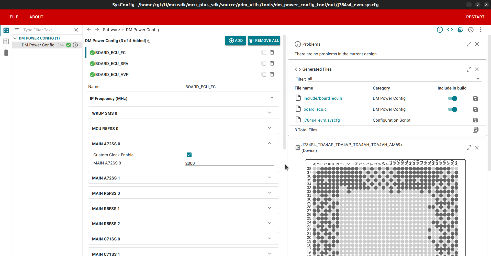
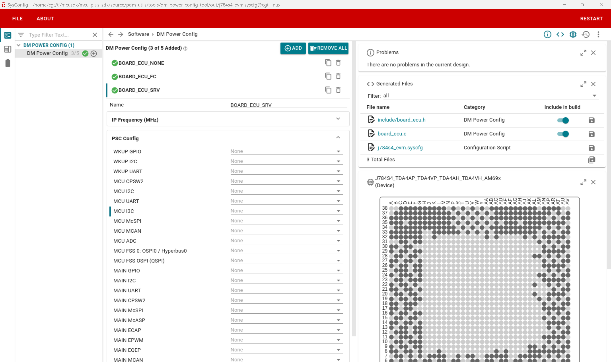
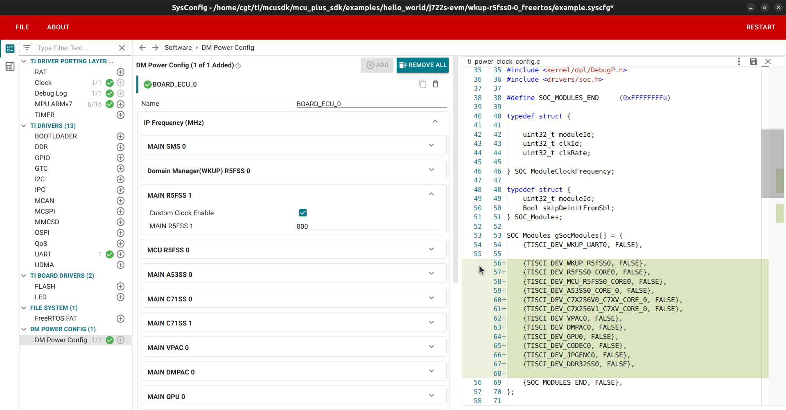
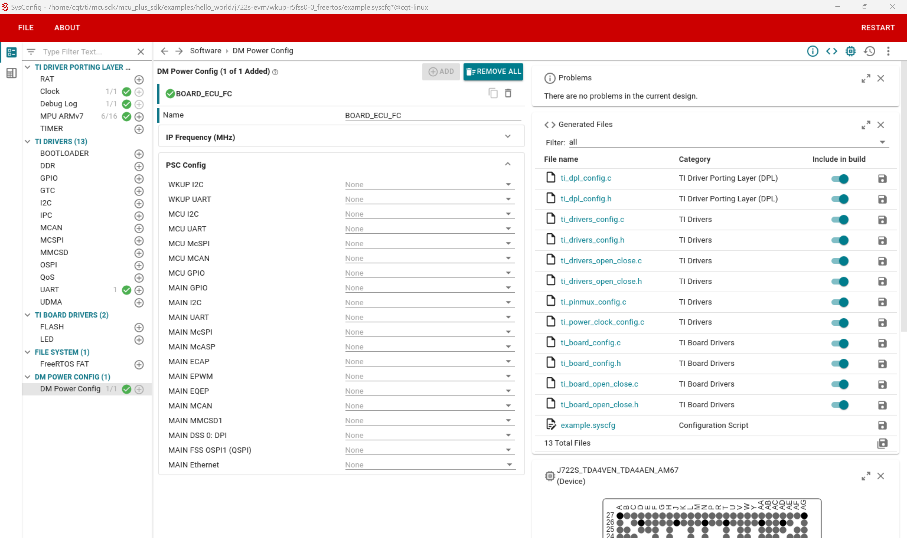

# DM Power Configuration Tool User Guide
- [DM Power Configuration Tool User Guide](#dm-power-configuration-tool-user-guide)
  - [Introduction](#introduction)
  - [How to Use the GUI and Generate Output Code](#how-to-use-the-gui-and-generate-output-code)
      - [Prerequisites](#prerequisites)
    - [For PDK](#for-pdk)
      - [Using Power Configurations on Board (PDK)](#using-power-configurations-on-board-pdk)
    - [For MCU+ SDK](#for-mcu-sdk)
    - [User Configuration](#user-configuration)
    - [Supported SoCs](#supported-socs)

## Introduction
DM Power Configuration Tool offers a user-friendly GUI for PLL (IP Frequency) and PSC configuration for the supported SoCs. User can create multiple config for different usecase. Based on UI config, code is generated for single/multiple config.

## How to Use the GUI and Generate Output Code

#### Prerequisites

- [SysConfig](https://www.ti.com/tool/SYSCONFIG) version 1.20.0

The SysConfig should be installed in a directory with the following structure: `$(HOME_DIR)/ti/sysconfig_$(SYSCONFIG_VERSION)`, where `HOME_DIR` represents your home directory and `SYSCONFIG_VERSION` is the version of SysConfig.

If you wish to use a different version of SysConfig or change the installation path, simply update the `SYSCONFIG_VERSION` or `SYSCFG_PATH` in the Makefile.

### For PDK

The PDK is a standalone tool that requires specific steps to generate output code in the correct locations.

1. **Open the DM Power Config Tool GUI**

   Run the following command to open GUI:
   ```
   make syscfg_gui BOARD=<board>
   ```

2. **Configure PLL and PSC**

    **IP Frequency (MHz)**

    This tab presents a list of key IPs within the SoC and enables users to configure their frequencies. To set the desired frequency, select the appropriate value and check the "Custom Clock Enable" checkbox. If this checkbox is disabled, the IP frequency will not be configured.
      <div style="display: flex;">
          
       </div>

    **Notes:**
    - The IP frequency settings depend on the configurations that the Device Manager (DM) can support.
    - The frequency values displayed in the tool are in MHz and should be specified with up to six decimal places when a fractional part is required. This level of precision        ensures that the desired frequency is accurately represented.
    - Some IPs may be non-editable, as they cannot be configured by the user.

   **PSC Config**

   This tab lists IPs that can be enabled or disabled using the checkbox.
       <div style="display: flex;">
          
      </div>

   The configuration settings made in the GUI will be saved in the file `out/<board>.syscfg`,  where `<board>` is the name of the SoC. . This file is utilized for generating the output code..


3. **Generate Code Based on the Configuration**

   After configuring the desired settings in the GUI, execute the following command to generate the code:
    ```
    make syscfg BOARD=<board>
    ```
   This will generate code in the respective files based on the GUI configuration done above.

#### Using Power Configurations on Board (PDK)
 1. Include the generated header file in application:
    `#include "board_ecu.h"`
 2. Based on Instance (and name), #define are created
    ```
    #define  BOARD_ECU_NONE        (0U)
    #define  BOARD_ECU_FC          (1U)
    #define  BOARD_ECU_SRV         (2U)
    #define  BOARD_ECU_AVP4        (3U)
    ```
   Call the initialization function with desired configuration:
   `Board_ecuInit(BOARD_ECU_FC);`

### For MCU+ SDK

This tool is seamlessly integrated into the SDK SysConfig infrastructure. GUI configuration is identical to the one described in the previous section. The generated code is automatically included in the `ti_power_clock_cfg.c` file. For more information about the SDK SysConfig and how to use it, please refer to the [MCU+ Academy](https://dev.ti.com/tirex/explore/node?node=A__ADGqnjXCjlsfY7kBsbtymg__com.ti.MCU_PLUS_ACADEMY_AM64X__n6QeJt5__LATEST).
    <div style="display: flex;">
        
        
    </div>

### User Configuration

Users can customize the list of IPs and PSCs supported by the tool. Refer to [config_readme.md](../config/.meta/config_readme.md) for detailed instructions on how to add or remove IPs and PSCs from the tool.

### Supported SoCs
- J784S4
- J722S/J7AEN
- J721S2
