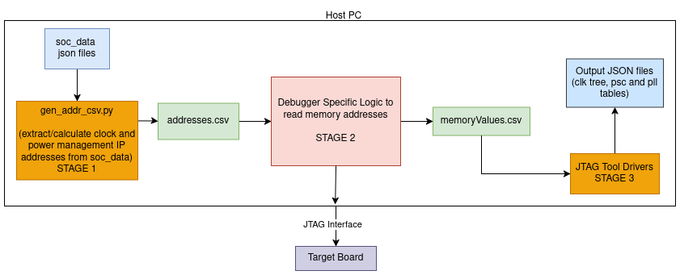
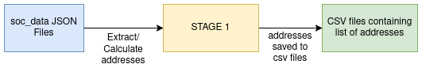
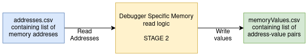
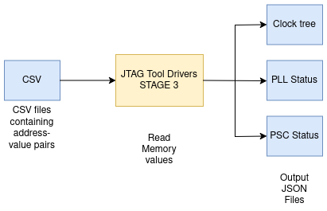

# JTAG Power Analysis Tool High-Level Design

- [JTAG Power Analysis Tool High-Level Design](#jtag-power-analysis-tool-high-level-design)
  - [1. Introduction](#1-introduction)
  - [2. Overview](#2-overview)
  - [3. Architecture](#3-architecture)
    - [3.1. Stage 1: Generation of list of register addresses](#31-stage-1-generation-of-list-of-register-addresses)
    - [3.2. Stage 2: Reading memory locations and generating address-value pairs](#32-stage-2-reading-memory-locations-and-generating-address-value-pairs)
    - [3.3. Stage 3: Parsing list of address-value pairs to generate and visualize output](#33-stage-3-parsing-list-of-address-value-pairs-to-generate-and-visualize-output)
  - [4. Input Data](#4-input-data)
    - [4.1. soc\_ip\_clock\_list.json](#41-soc_ip_clock_listjson)
    - [4.2. soc\_clk\_data.json](#42-soc_clk_datajson)
    - [4.3. soc\_clk\_data\_div.json](#43-soc_clk_data_divjson)
    - [4.4. soc\_clk\_data\_mux.json](#44-soc_clk_data_muxjson)
    - [4.5. soc\_pll\_data.json](#45-soc_pll_datajson)
    - [4.6. soc\_clk\_data\_mux\_parents.json](#46-soc_clk_data_mux_parentsjson)
    - [4.7. soc\_psc\_data.json](#47-soc_psc_datajson)
    - [4.8. mem\_addr/soc\_clk\_data\_div\_addr.csv](#48-mem_addrsoc_clk_data_div_addrcsv)
    - [4.9. mem\_addr/soc\_clk\_data\_mux\_addr.csv](#49-mem_addrsoc_clk_data_mux_addrcsv)
    - [4.10. mem\_addr/soc\_pll\_data\_addr.csv](#410-mem_addrsoc_pll_data_addrcsv)
    - [4.11. mem\_addr/soc\_psc\_data\_addr.csv](#411-mem_addrsoc_psc_data_addrcsv)
    - [4.12 soc\_mmr.json](#412-soc_mmrjson)
  - [5. Run-time Settings](#5-run-time-settings)
    - [Clock-Tree](#clock-tree)
    - [PLL](#pll)
    - [PSC](#psc)
  - [6. Output](#6-output)
  - [7. Adding Support for a Debugger](#7-adding-support-for-a-debugger)
    - [7.1. Create Debugger Implementation File](#71-create-debugger-implementation-file)
    - [7.2. Update Main Entry Point](#72-update-main-entry-point)
    - [7.3. Update Documentation](#73-update-documentation)

## 1. Introduction

JTAG Power Analysis Tool is a software-based tool that enables the retrieval of clock tree, PLLs, and PSCs settings from a device at runtime. This functionality allows for a comprehensive understanding of the device from a Device Management perspective.

## 2. Overview

JTAG Power Analysis Tool provides comprehensive understanding of a device's clock tree, PLLs, and PSCs. It does this by utilizing scripting support of any of the supported debuggers to read device MMRs.

To generate the clock tree, the tool needs some static device-specific details and some run-time settings. The static device-specific information is present in soc_data folder. JTAG Power Analysis Tool reads the MMRs to determine the runtime configuration of the device.

## 3. Architecture

The block diagrams below depict the high-level architecture of the JTAG power analysis tool. The working of the tool is divided into three stages, which are as follows:

- Generation of 'addresses.csv' containing the list of register addresses to be read.
- Using the addresses list, the debugging software (e.g. CCS, Trace32, etc) reads the register addresses on the SoC and produces 'memoryValues.csv' containing the list of register addresses and their values in a key-value fashion.
- Parsing the address-value pairs to generate and visualize clock tree, PLL and PSC tables.



### 3.1. Stage 1: Generation of list of register addresses
This stage generates the list of register addresses which will be read. The list is generated from the various JSON files which are part of the soc_data folder. These JSON files contain information of the clocks, MUXs, PLLs and PSC and their corresponding addresses.

The addresses are extracted/calculated from soc_data json files, which are static and change only when there are any changes in the soc.json. Thus, this step is run only once (on running [main.py](../internal/soc_gen/main.py)), and the addresses csv files are saved in the tool repository.

**Input**: SOC json files containing details of the clocks, PLLs, PSCs, etc.

**Output**: CSV files containing the list of absolute register addresses to be read. Separate files for clock addresses, PLL address and PSC addresses will be generated.

Output File Type and Format:

The type and format of the file containing the list of memory addresses are the following:

- File Type - CSV (.csv)
- File Format: List of memory addresses, each in a new line.



### 3.2. Stage 2: Reading memory locations and generating address-value pairs

The debugging software (Trace32, CCS, or others) takes the list of addresses generated in stage 1 as input, and reads the values at those addresses from the target device (connected to the host PC via a JTAG interface). The values read are saved to a file (say memoryValues.csv) as address-value pairs.

This stage has three sub-stages:

- Taking addresses list file as input.
- Reading values at register addresses on the SoC.
- Saving the values read into a file as address-value pairs.

**Input**: addresses.csv file generated in stage 1.

**Output**: memoryValues.csv file containing list of address-value pairs, each in a new line.



For debugger specific design of stage 2, refer the following:

- **JTAG Power Analysis Tool with CCS**: [JTAG Power Analysis Tool - Stage 2 with CCS - High-Level Design](./jtag_tool_with_ccs/design.md)

- **JTAG Power Analysis Tool with Trace32**: [JTAG Power Analysis Tool - Stage 2 with Trace32 PowerView and OpenOCD - High-Level Design](./jtag_tool_with_trace32/design.md)

### 3.3. Stage 3: Parsing list of address-value pairs to generate and visualize output

The output file generated in stage 2 now contains the list of register addresses and their corresponding values. This is utilized by the tool to generate JSON output files containing the results in a presentable manner (tables, lists, etc).

**Input**: The input files for this stage are the files containing list of address-value pairs generated in stage 2.

**Output**: The output files are JSON files containing tables, lists, etc to visualize the clock tree, PLL and PSC status and settings.



## 4. Input Data

Inputs are specific hardware attributes that are generated once and are present in the `soc_data/<soc>`and `soc_data/<soc>/mem_addr` folders. These attributes are used to generate the clock tree, PLL status, and PSC status for an SoC.

### 4.1. soc_ip_clock_list.json

This file contains all ips and clocks connected to the ip along with dividers.
In j784s4, ADC in MCU domain has 3 input clocks adc_clk,sys_clk and vbus_clk with 1,2 and 3 as input divider

```
"J784S4_DEV_MCU_ADC12FC_16FFC0": [
        {
            "input_name": "DEV_MCU_ADC12FC_16FFC0_ADC_CLK",
            "clk_name": "CLK_J784S4_MCU_ADC_CLK_SEL_OUT0",
            "div": 1
        },
        {
            "input_name": "DEV_MCU_ADC12FC_16FFC0_SYS_CLK",
            "clk_name": "CLK_J784S4_K3_PLL_CTRL_WRAP_WKUP_0_CHIP_DIV1_CLK_CLK",
            "div": 2
        },
        {
            "input_name": "DEV_MCU_ADC12FC_16FFC0_VBUS_CLK",
            "clk_name": "CLK_J784S4_K3_PLL_CTRL_WRAP_WKUP_0_CHIP_DIV1_CLK_CLK",
            "div": 3
        }
    ]
```

### 4.2. soc_clk_data.json

This file contains clock-specific data. Each clock in the file is associated with a set of attributes that define its behavior. The following attributes are available:

- `type`: This attribute specifies the type of clock. It can be one of the following:

    - `MUX`: Clock is mux type
    - `DIV`: Clock is a Divider (HSDIV)
    - `NONE/ not defined`: This type of clock does not have any specific attributes.

- `parent`: This attribute specifies the parent clock of a clock. If a clock has a fixed parent, the parent clock name is specified in this attribute. If a clock has multiple parents, the `data` attribute contains the parents information.

- `drv`: This attribute specifies the driver to be used for the clock. A driver is a piece of code that provides clock-specific methods.

- `data`: This attribute contains clock-specific data. It can include information about the clock's register, bit-field, and other attributes.

```
"CLK_J784S4_MCU_ADC_CLK_SEL_OUT0": {
        "type": "CLK_TYPE_MUX",
        "drv": "clk_drv_mux_reg",
        "data": "clk_data_MCU_ADC_clk_sel_out0"
    },
"CLK_J784S4_K3_PLL_CTRL_WRAP_WKUP_0_CHIP_DIV1_CLK_CLK": {
    "parent": {
            "clk_name": "CLK_J784S4_K3_PLL_CTRL_WRAP_WKUP_0_SYSCLKOUT_CLK",
            "div": 1
        },
        "drv": "clk_drv_div_reg",
        "data": "clk_data_k3_pll_ctrl_wrap_wkup_0_chip_div1_clk_clk"
    },
```

### 4.3. soc_clk_data_div.json

It contains the dividers register address and bit-field

```
"clk_data_hsdiv0_16fft_main_12_hsdiv0": {
        "reg": "0x68c080",
        "start_bit": 0,
        "bitfield_width": 7
    }
```

### 4.4. soc_clk_data_mux.json

This file contains a mapping of clock mux names to their respective parent lists.
The parent lists are defined in `soc_clk_data_mux_parents.json` and include the parent clock names and divider values.
The register and bit information in this file is used to read the mux setting, which determines the active parent clock.

```
"clk_data_MCU_ADC_clk_sel_out0": {
        "parents": "clk_MCU_ADC_clk_sel_out0_parents",
        "reg": "0x40f08040",
        "start_bit": 0,
        "bitfield_width": 2
    },
```

### 4.5. soc_pll_data.json

This file contains base address and ID of PLL.

```
"clk_data_pllfracf2_ssmod_16fft_main_0": {
        "base": "0x00680000",
        "idx": 0
    }
```

### 4.6. soc_clk_data_mux_parents.json

This file contains list of parent along with dividers connected to a mux.

```
"clk_MCU_ADC_clk_sel_out0_parents": [
        {
            "clk_name": "CLK_J784S4_GLUELOGIC_HFOSC0_CLKOUT",
            "div": 1
        },
        {
            "clk_name": "CLK_J784S4_HSDIV4_16FFT_MCU_1_HSDIVOUT1_CLK",
            "div": 1
        },
        {
            "clk_name": "CLK_J784S4_HSDIV1_16FFT_MCU_0_HSDIVOUT1_CLK",
            "div": 1
        },
        {
            "clk_name": "CLK_J784S4_BOARD_0_MCU_EXT_REFCLK0_OUT",
            "div": 1
        }
    ]
```

### 4.7. soc_psc_data.json

This provides information about all the Local Power and Sleep Controller (LPSC) instances in an SoC. It lists the LPSCs and their associated Global Power and Sleep controller (GPSC), Power Domain (PD), the IPs connected to each LPSC etc.

```
"LPSC_mcu_adc_0": {
    "gpsc_name": "WKUP_PSC0",
    "lpsc_name": "LPSC_mcu_adc_0",
    "base_addr": "0x0000000042000000",
    "lpsc_index": 15,
    "pd_name": "PD_wkup",
    "pd_index": 0,
    "controlled_ip_instances": ["MCU_ADC0"]
},
```

### 4.8. mem_addr/soc_clk_data_div_addr.csv
This lists memory addresses related to divider registers. This list is utilized by any debugger to read the values at these addresses.

```
0x687080
0x68209c
0x685088
...
```

### 4.9. mem_addr/soc_clk_data_mux_addr.csv
This lists memory addresses related to clock mux settings. This list is utilized by any debugger to read the values at these addresses.

```
0x1082b0
0x108380
0x108350
...
```

### 4.10. mem_addr/soc_pll_data_addr.csv
This lists memory addresses related to PLLs. This list is utilized by any debugger to read the values at these addresses.

```
0x68f0ac
0x691020
0x68209c
...
```

### 4.11. mem_addr/soc_psc_data_addr.csv
This lists memory addresses related to all the LPSCs. This list is utilized by any debugger to read the values at these addresses.

```
0x68f0ac
0x691020
0x68209c
...
```


### 4.12 soc_mmr.json

This file contains MMR (Memory-Mapped Registers) values of various IPs in an SoC. The values are read from device registers.

Currently, the file contains MMR values only for VTM.

## 5. Run-time Settings

The run-time settings for JTAG Power Analysis Tool are read from the device's registers. This includes information such as clock dividers and multipliers, PLL settings, and PSC settings.

### Clock-Tree

The soc clocking architecture is created using input data. It contains static path as well as dynamic path (Ex Mux setting, Plls, Dividers/multiplier). To generate a clock tree, from any source clock, a clock driver is create which whose parent is `ClkDrv`. Based on type of clock `getParentClock` returns the parent and divider/multiplier of the clock. `getClockPathUptoRoot` utilizes `getParentClock` recursively until it reaches a HFOSC.(refer [Low_level_design](../internal/low_level_design/low_level_design.md))

### PLL

The `ClkDrvPll` class is responsible for retrieving the settings of a specific type of PLL (16FFT). It provides methods to retrieve the parent clock, PLL dividers, PLL enable status, number of HSDIVs, frequency of a specific HSDIV, frequencies of all HSDIVs, and output frequency of the PLL. The class reads various fields from the socClkData and socPllData objects to calculate the desired values.

### PSC

The `LpscDrv` class reads Power domain and Module domain status for each LPSC in `psc_data.json'.

## 6. Output

Refer to [user_guide ](../user_guide.md)

## 7. Adding Support for a Debugger

Currently the JTAG Power Analysis Tool supports debuggers like CCS and Trace32 (see list of [supported debuggers](./user_guide.md/#19-supported-debuggers)). The function of a debugger in this tool is only to read memory addresses listed in the addresses.csv files and create mem_values.csv files containing address-value pairs.

For example:
- [execute_ccs.js](../src/execute_ccs.js) contains the logic to initialize and run CCS to read memory addresses and create mem_values csv files.
- [execute_t32.js](../src/execute_t32.js) contains the logic to initialize and run Trace32 PowerView with OpenOCD to read memory addresses and create mem_values csv files.

In order to add support for a new debugger to this tool, one has to write the logic to initialize and run the desired debugger to read the memory locations in addresses.csv files, and create mem_values.csv files, and update [main.js](../src/main.js) to add the debugger to supported debuggers list.

Assuming a new debugger "debugger" is needed to be supported by the JTAG power analysis tool. Follow the below steps to add support for this new debugger.

### 7.1. Create Debugger Implementation File
In this file, implement the logic to do the following:
- Initialize and configure the debugger
- Run the debugger to read memory addresses from various addresses.csv files, read the value at those addresses from device, and write the results to mem_values.csv files as address-value pairs.
- Any debugger specific clean up

Create a new file `execute_<debugger>.js` in the `src` directory. For example, for a debugger named "debugger", create `execute_debugger.js`.

The implementation could include:

```javascript
class Debugger {
    constructor() {
    }

    /**
     * Initialize the debugger and establish connection
     */
    init(args) {
        /*
        Initialize debugger-specific connection
        Configure any necessary parameters
        */
    }

    /**
     * Read memory values from specified addresses.csv files
     */
    readMemory(addressFilePath) {
        /*
        Read addresses from addresses.csv file
         For each address:
           - Read memory value using debugger
           - Format output as "address,value"

         Save outputs to mem_values.csv files
        */
    }

    /**
     * Main execution function
     */
    run() {
        /*
        Based on the selector and soc values, figure out which addresses.csv files to read,
        and call readMemory function for those files
        */
    }
}

function executeDebugger(config, soc, selector) {
    try {
        const debugger = new Debugger();
        debugger.init(config, soc, selector);
        debugger.run();
        return { success: true, error: null };
    } catch (error) {
        return { success: false, error };
    }
}

module.exports = {
    executeDebugger
};
```

### 7.2. Update Main Entry Point

Modify [main.js](/tools/jtag_power_analysis_tool/src/main.js) to include support for the new debugger:

- Add the debugger to supported list:
```javascript
static supportedIde = ["ccs", "t32", "debugger"]; /* Add new debugger to the list */
```

- Add implementation handling in `createMemoryOutputs`:
```javascript
if (ide === 'debugger') {
    /* call memory read logic for new debugger 'abc' */
    const response = executeDebugger(config, this.soc, this.selector);
    if (!response.success) {
        throw new Error("Error in execution with ABC", response.error);
    }
}
```

### 7.3. Update Documentation

- Update `user_guide.md`:
   - Add new debugger to supported debuggers list
   - Document any debugger-specific configuration requirements
   - Add examples of using the tool with the new debugger

- Update `design.md`:
   - Document the design approach for the new debugger integration
   - Explain any debugger-specific implementation details

- Update `help()` function:
   - Add additional help info for the new debugger if needed
