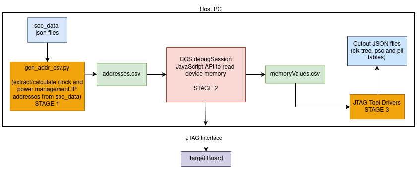

# JTAG Power Analysis Tool - Stage 2 with Code Composer Studio (CCS) - High-Level Design 

## Overview

This document outlines the design for Stage 2 of JTAG Power Analysis Tool using Code Composer Studio (CCS). This stage reads a list of clock and power management IP addresses, reads their values from device, and outputs the address-value pairs for further analysis. This workflow is essential for capturing register values that will be further processed to retrieve and visualize clock tree, PLL and PSC settings.

## Architecture


This document talks about the detailed design of Stage 2 of the JTAG Power Analysis Tool with Code Composer Studio (CCS).

### Components

#### Input Data

- **Description:** Static, device-specific information.
- **Format:** addresses.csv files containing a list of clock and power management IP addresses.
- **Example:**  
  ```
  0x40023800
  0x40023804
  0x40023808
  ```

#### Processing Logic


- **Description:** The debugSession and JavaScript API provided by CCS is utilized read the memory values at the addresses specified in addresses.csv files from device, and writes the results to an output mem_values.csv file.
- **Key Functions:**
  - Reads addresses from the addresses.csv file.
  - Fetches values from device memory at those addresses.
  - Writes address-value pairs to mem_values.csv files.

- **Sample Script to read memory values using CCS JavaScipt API:**
  ```plaintext
  //list of addresses to read
  const addresses = {...}

  //list of address-value pairs
  const mem_values = []

  for(let i = 0; i<addresses.length; i++){
    const address = addresses[i];

    //read values at address using CCS debugSession API
    const value = session.memory.readOne(address);

    mem_values.push(`${address},${value}\n`);
  }
  ```

#### Output Data

- **Description:** mem_values.csv files containing memory address-value pairs.
- **Format:**  
  Each row consists of an address and its corresponding value, separated by a comma.
- **Example:**  
  ```
  0x40023800,12345678
  0x40023804,87654321
  ```
