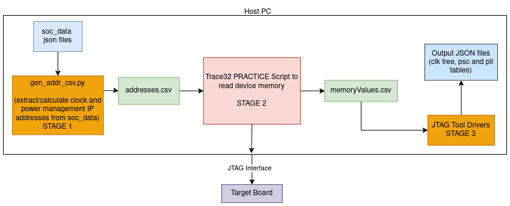
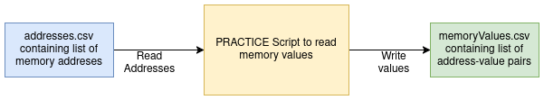

# JTAG Power Analysis Tool - Stage 2 with Trace32 PowerView and OpenOCD - High-Level Design 

## Overview

This document outlines the design for Stage 2 of JTAG Power Analysis Tool using Lauterbach Trace32 PowerView and OpenOCD. This stage reads a list of clock and power management IP addresses, extracts their values from device via a PRACTICE script, and outputs the address-value pairs for further analysis. This workflow is essential for capturing register values that will be further processed to retrieve and visualize clock tree, PLL and PSC settings.

## Architecture


This document talks about the detailed design of Stage 2 of the JTAG Power Analysis Tool with Trace32 PowerView and OpenOCD.

### Components

#### Input Data

- **Description:** Static, device-specific information.
- **Format:** addresses.csv files containing a list of memory addresses.
- **Example:**  
  ```
  0x40023800
  0x40023804
  0x40023808
  ```

#### Processing Logic



- **Description:** A PRACTICE script executed by Trace32 reads the input CSV, reads the values at those memory addresses, and writes the results to an output CSV file.
- **Key Functions:**
  - Reads addresses from the addresses.csv file.
  - Fetches values from device memory at those addresses.
  - Writes address-value pairs to a mem_values.csv files.

- **Sample PRACTICE Script:**
  ```plaintext
  ;Trace32 Script to read memory addresses and save address-value pairs to csv file

  ;Parameters at execution:
  ;pll_addr_file_path -> path of csv file containing addresses
  ;values_dir -> output directory for result file
  ;pll_values_file_name -> output file name

  LOCAL &pll_addr_file_path &values_dir &pll_values_file_name
  PARAMETERS &pll_addr_file_path &values_dir &pll_values_file_name

  OPEN #1 "&pll_addr_file_path" /Read

  IF (OS.DIR("&values_dir"))
  (
    GOTO output
  )
  ELSE
  (
    OS.Command mkdir -p &values_dir
  )

  output:
  &pll_values_file_path="&values_dir"+"/"+"&pll_values_file_name"
  OPEN #2 "&pll_values_file_path" /Create

  PRIVATE &address
  WHILE TRUE()
  (
    READ #1 %LINE &address
    IF EOF()
    (
      GOTO loop_end
    )
    PRIVATE &value
    &value=Data.Long(D:&address)
    WRITE #2 "&address," %Decimal &value
  )
  loop_end:PRINT "File &pll_addr_file_path Read"
  CLOSE #1
  CLOSE #2
  ```

#### Output Data

- **Description:** mem_values.csv files containing memory address-value pairs.
- **Format:**  
  Each row consists of an address and its corresponding value, separated by a comma.
- **Example:**  
  ```
  0x40023800,12345678
  0x40023804,87654321
  ```
