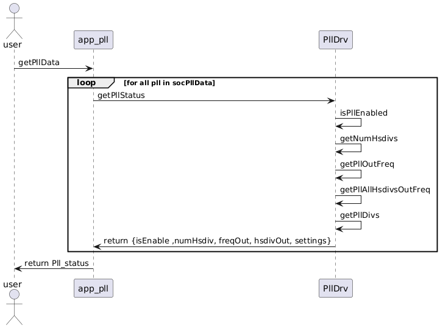
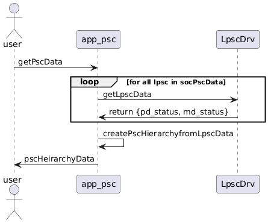
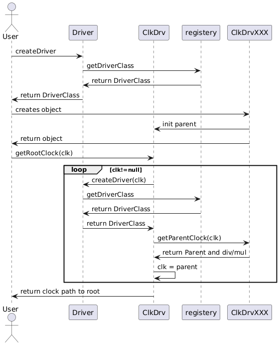
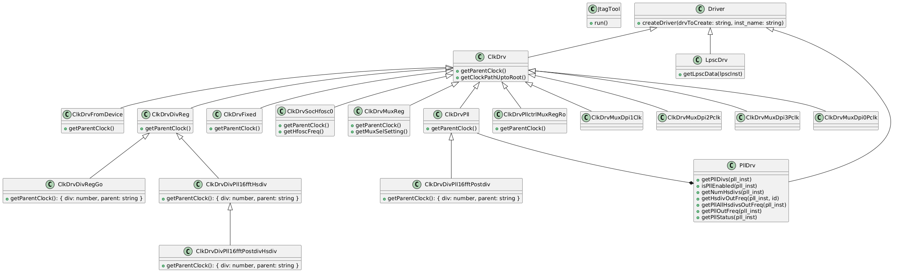

# Low Level Design of JTAG Power Analysis Tool

## Introduction

This document outlines the low level design of the JTAG Power Analysis Tool. The JTAG Power Analysis Tool is responsible for generating a comprehensive understanding of the clock tree, PLLs, and PSCs.

## PLL Module

The PLL module is responsible for generating the status of a PLL. It reads the PLL settings from the hardware registers and calculates the frequency of the PLL.

## PSC Module

The PSC module is responsible for generating the status of a PSC. It reads the PSC settings from the hardware registers and determines the status of Power Domain and Module Domain .

## Clock Tree

The Clock Tree module is responsible for generating the clock tree. It reads the clock tree settings from the hardware registers and calculates the clock path.

## Class UML

